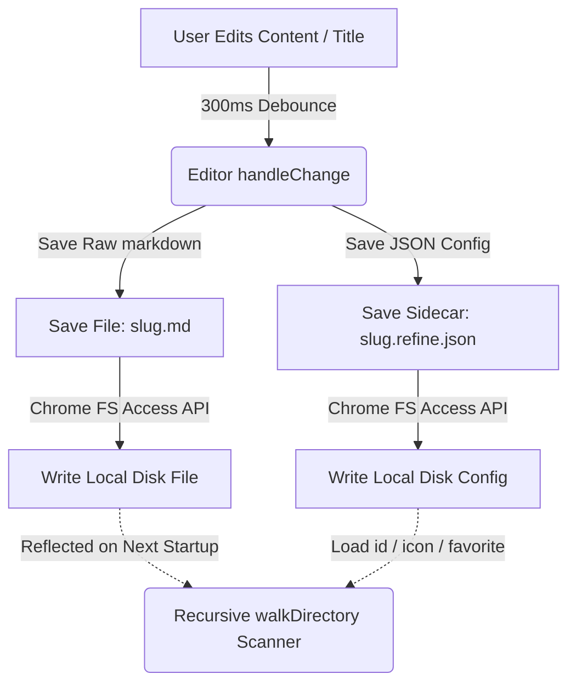
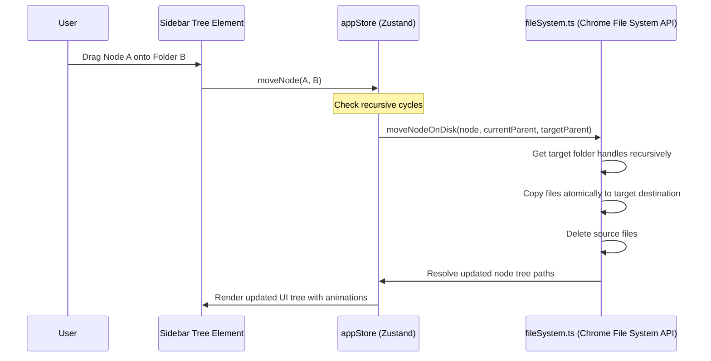

# ✦ Refine ✦

<div align="center">
  <p align="center">
    <strong>A Premium, Local-First, Direct-OS-Mirroring Markdown Notebook.</strong>
  </p>
  <p align="center">
    Built for speed, keyboard-first navigation, and visual excellence. Designed with a custom glassmorphic dark-theme system, neon-accented micro-animations, and direct hardware-level workspace syncing.
  </p>
</div>

---

## 🎨 Visual System & Premium Aesthetics

Refine is engineered from the ground up to feel extremely premium, responsive, and tactile:
*   **Electric HSL Color Palette**: Tailored deep dark backgrounds (`#0a0a0f`) offset by high-contrast primary text, electric violet primary accents (`hsl(250, 85%, 60%)`), and neon indigo secondary accents (`hsl(230, 85%, 60%)`).
*   **Glassmorphism & Glow Effects**: Sidebar headers, popups, command palettes, and active selections float above the canvas with subtle backdrop filters, semi-transparent borders, and radiant box-shadow accent glows.
*   **Dynamic Interactive Animations**: Active buttons, dropdown nodes, page items, and autocomplete boxes react seamlessly via CSS transitions, custom float keyframes, and micro-animations.

---

## 🌟 Feature Tour

Refine replaces traditional monolithic cloud databases with a native local-first sync loop that leverages modern browser capabilities.

### 1. Direct-to-Disk Workspace Mirroring
Unlike tools that use bloated index files or virtual databases, Refine directly mirrors your physical OS file structure.
*   **Zero Manifest Files**: No `.manifest.json` files or index DB registries. The physical files and folders in your selected directory *are* the actual state of your app.
*   **Universal Sidecar Configs**: Every `.md` page creates a matching `.refine.json` sidecar storing specific custom metadata (such as note persistent IDs, page emoji icons, and favorite status).
*   **Auto-Healing Structure**: Deleting, creating, or renaming files in your local file explorer is automatically reconciled in the visual sidebar tree upon launch.

### 2. Double-Bracket Wikilinks (`[[`) & Hash Routing
*   **Contextual Autocomplete**: Type `[` anywhere inside a block, and the second `[` triggers a floating search bubble showing up to 6 matches from your active pages with custom emoji and keyboard navigation.
*   **Hash-Based SPA Routing**: Links are resolved as standard hash links (`#refine-pageId`) in the DOM. This bypasses browser-level protocol interception (preventing Chrome from opening new blank tabs) and triggers instant internal transitions via state routers.
*   **Valid Markdown Serialization**: Automatically serializes inside the underlying `.md` file to valid Markdown links (`[Page Title](#refine-pageId)`), making it fully readable by other IDEs (like Obsidian, VS Code, or standard editors).

### 3. Drag-and-Drop Structure Editing
*   **Fluid Reorganization**: Reorder and nest files and folders natively by dragging them in the sidebar tree.
*   **Zero-Cycle Prevention**: Custom path loops are mathematically blocked (e.g. you cannot drag a folder inside one of its own subfolders).
*   **Atomic Disk Updates**: Dragging elements triggers recursive physical renames and file moves in your computer’s workspace via Chrome's File System Access APIs.

### 4. Hybrid Search Command Palette (`Ctrl + K`)
*   **Instant Overlay**: Press `Ctrl + K` to summon a blurred, frosted command center.
*   **High-Performance Fuzzy Matching**: Performs instant indexing and score-based query searches across titles and page contents.
*   **Inline Highlights**: Instantly highlights matching characters inside the search results with exact keyboard layouts (up/down arrows, enter to open, escape to exit).

### 5. Emoji & Icon Header System
*   **Visual Personalization**: Select a page-level emoji using a gorgeous 60-emoji grid selector that floats elegantly above active note titles.
*   **Sidebar Integration**: Selected emojis are dynamically synced back to sidecar config metadata and rendered immediately next to page titles in the file tree.

### 6. Favorites & Pinned Pages
*   **Dedicated Section**: Right-click any note to toggle "Add to Favorites". Favorited pages are rendered flat in a dedicated `★ Favorites` sidebar section right below the search bar.
*   **State Persistence**: Favorite statuses are written to the note's `.refine.json` sidecar, keeping your workspace configurations persistent across restarts.

### 7. Interactive Vault Management Footer
*   **Interactive Status Pill**: Displays your active vault folder name in the sidebar footer with a live status dot indicating save states (`saved`, `saving`, `error`).
*   **One-Click Shift**: A bottom popover allows you to click "Change Vault" to swap to a different local workspace, or click "Copy Name" to instantly copy the folder path/name with visual copy feedback.

---

## 🛠️ Architecture

The diagrams below demonstrate how direct-to-disk synchronization operations are bound:

### Direct-to-Disk Node Sync System



### Drag & Drop Reorganization flow



---

## 💻 Codebase Tour

```bash
refine/
├── src/
│   ├── components/
│   │   ├── CommandPalette/     # Frosted Ctrl+K fuzzy search overlay
│   │   ├── ContextMenu/        # Custom node actions & Favorite toggles
│   │   ├── Editor/             # BlockNote implementation, slash command items & Wikilink autocomplete
│   │   │   ├── blocks/         # Custom embeds, quote boxes, and extended headings
│   │   │   ├── Editor.tsx
│   │   │   └── Editor.css      # Custom custom-link chip overrides
│   │   ├── Layout/             # Multi-pane grid frameworks
│   │   └── Sidebar/            # Direct folder trees, Favorites section & Vault popover
│   ├── store/
│   │   └── appStore.ts         # Central Zustand dispatcher (vault selectors, move actions)
│   ├── utils/
│   │   ├── fileSystem.ts       # Chrome File System Access API recursive workspace scanner
│   │   └── indexedDB.ts        # Persisted vault directories handles
│   ├── App.tsx                 # Router container
│   ├── index.css               # Main visual system, CSS variables & typography tokens
│   └── main.tsx                # App entrypoint
├── package.json
└── vite.config.ts
```

---

## 🚀 Setup & Local Development

### Prerequisites
*   **Node.js**: `v18` or higher
*   **Supported Browser**: Chrome, Edge, or Opera (supporting the *HTML5 File System Access API* `showDirectoryPicker`)

### Steps

1.  **Clone & Navigate**:
    ```bash
    git clone https://github.com/Abinanthan-CG/Refine.git
    cd Refine
    ```

2.  **Install dependencies**:
    ```bash
    npm install
    ```

3.  **Run Dev Server**:
    ```bash
    npm run dev
    ```
    This launches the application in development mode at [http://localhost:5173](http://localhost:5173).

4.  **Production Build & Compression**:
    ```bash
    npm run build
    ```
    This compiles high-performance modular chunks inside the `dist/` directory.

---

## 🔒 Security & Privacy

*   **100% Client-Side**: Refine runs entirely in your browser memory. Your ideas and notes are never processed on external cloud servers.
*   **Standard Local Files**: Notes are saved as plain Markdown (`.md`) text and JSON configs directly in your local operating system directory. You own your data.

---

## 📄 License

Refine is licensed under the [MIT License](file:///c:/Users/dabin/development/Refine/LICENSE). Feel free to modify, deploy, and self-host!
